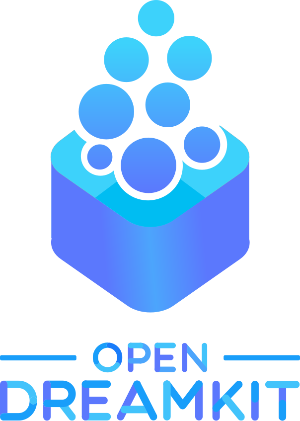

# ReproduciblePython  🐍🐱‍👤

Materials associated with the [PyCon 2018](https://us.pycon.org/2018/about/) workshop on reproducible analysis in Python.

The proposal for this workshop can be found in the [proposal.md](./proposal.md) file.

---

### Slides
🗒️ The slides for the workshop can be found here:
- [Online html version](http://bitsandchips.me/Talks/PyCon.html): **interactive slides**
- [PDF version](http://doi.org/cn9t)

---

### 💬 Discussion

We will encourage discussions over the workshop, for this purpose we will be using an Etherpad. Click on the following link:  [https://public.etherpad-mozilla.org/p/ReproduciblePython](https://public.etherpad-mozilla.org/p/ReproduciblePython)

---

### 🗃️ The content

This material covers the basics of reproducible workflows in Python and is provided in the following sections:

0. [Setup](00_Setup.ipynb): installation instructions for the workshop
1. [Setting up projects](01_ProjectStructure.ipynb): advise on best practices to set up projects with a reproducibility-first approach
2. [Working with data](02_WorkingWithData.ipynb): information on how to use, archive, and share data
3. [Processing data, workflows](03_ProcessData.ipynb): producing automated wokrflows
4. [All things testing](04_Testing.ipynb): introduction to testing of standalone scripts and Jupyter notebooks
5. [Making code public](05_SharingAnalysis.ipynb): how to share your code and being credited for it

### 🦄 Additional materials
These are complementary materials that you can follow at your own pace if you wanted to dive further.

- [Getting started with Docker](Docker.ipynb): introduction to containers and usage of repo2docker
- [Sharing your interactive notebooks using Binder](Binder.ipynb)
- [Introduction to Datalad](Datalad.ipynb)

## Solutions
The solutions to the tutorial can be found in the solutions folder. Make sure to read
the [solutions README first](solutions/README.md)

## 🖥️ What do I need for this workshop?
The installation instructions can be found at [http://bitsandchips.me/ReproduciblePython/Setup.html](http://bitsandchips.me/ReproduciblePython/Setup.html)

## Acknowledgements

The development of this material was funded by [OpenDreamKit][odk],
a [Horizon2020][h2020] European [Research Infrastructure][res-inf] project ([676541][odk-grant]) that aims to
advance the open source computational mathematics ecosystem.

 ---
  This work is licensed under a <a rel="license" href="http://creativecommons.org/licenses/by/4.0/">Creative Commons Attribution 4.0 International License</a>.

[odk]: http://opendreamkit.org/
[h2020]: https://ec.europa.eu/programmes/horizon2020/
[res-inf]: https://ec.europa.eu/programmes/horizon2020/en/h2020-section/european-research-infrastructures-including-e-infrastructures
[odk-grant]: http://cordis.europa.eu/project/rcn/198334_en.html
[uos-rse]: http://rse.shef.ac.uk
